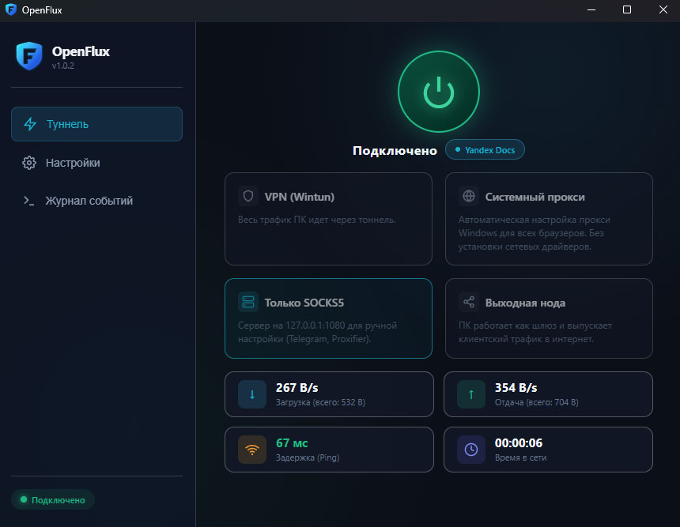
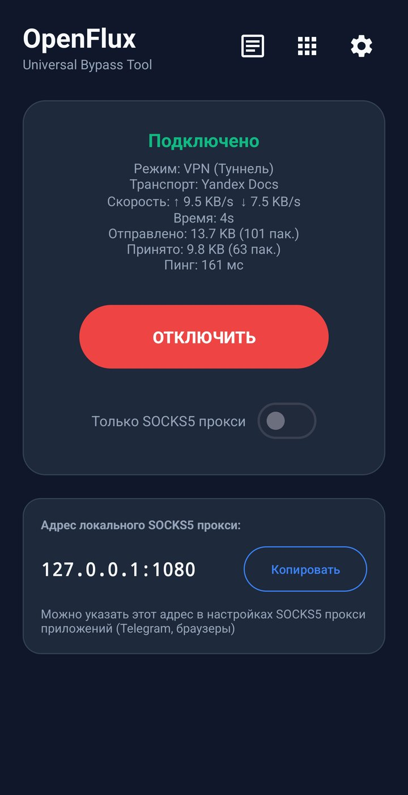
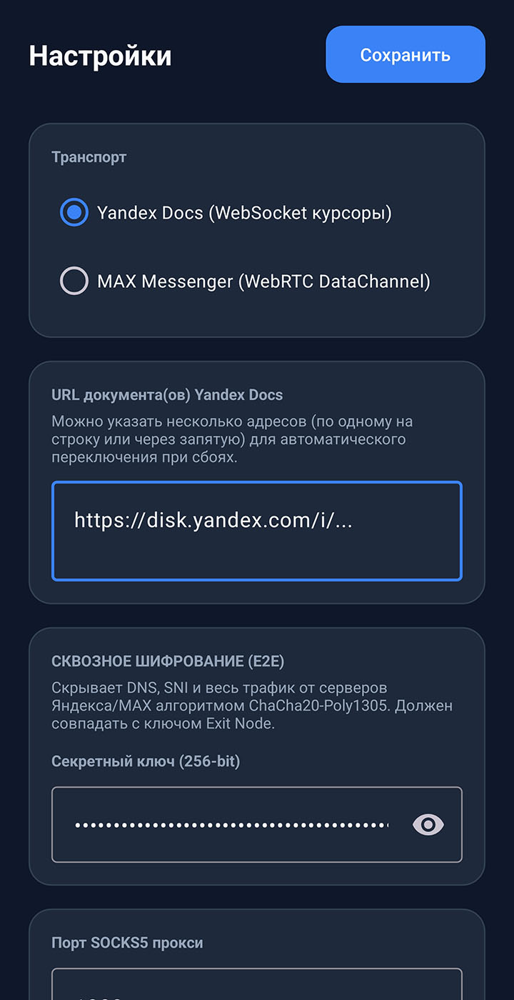
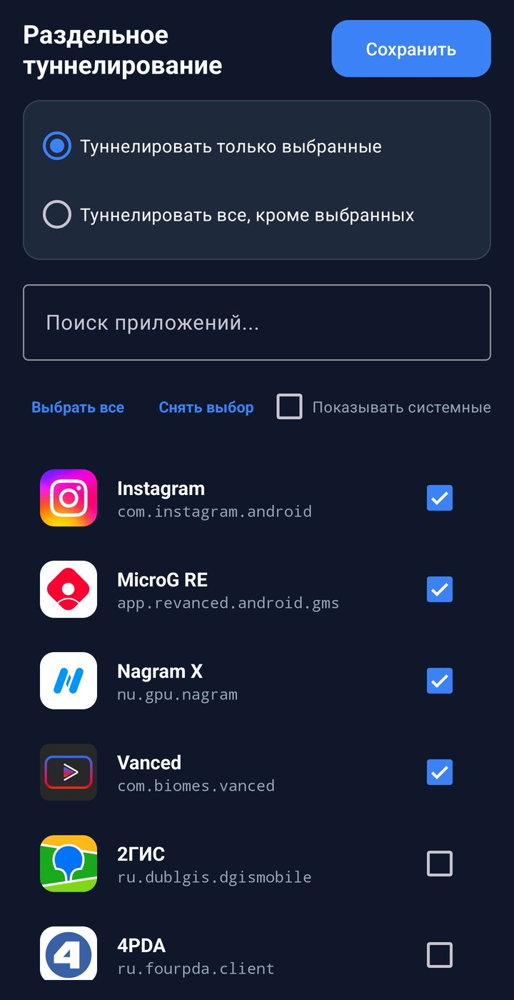
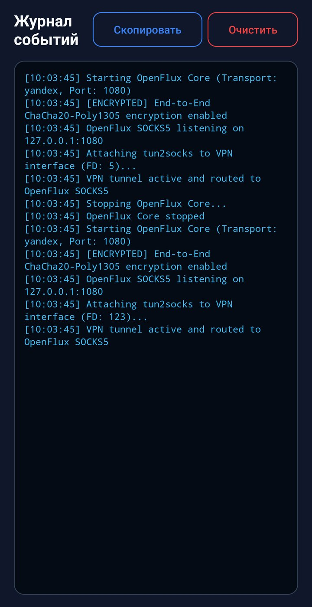

# OpenFlux — Covert Network Tunnel & Android Client

**English** | [Русский](README.ru.md) | [**Fork Differences**](FORK.md)

**OpenFlux** is an advanced network tunneling framework designed to disguise and route TCP traffic through legitimate cloud services (such as Yandex Docs WebSocket collaboration sessions and MAX WebRTC DataChannels). This repository is an enhanced, production-ready fork of [p1neappleXpress/OpenFlux](https://github.com/p1neappleXpress/OpenFlux) featuring End-to-End AEAD encryption, a native Android client, resilient multi-URL failover pooling, and Docker deployment (see [FORK.md](FORK.md) for details).

# Disclaimer

The authors of OpenFlux **do not encourage** the use of this project to bypass restrictions or violate the rules of any platform, and **are not responsible** for the final scenarios of how users apply this tool in real life or on the Internet. Any specific technical features of the application are nothing more than an **architectural coincidence**, created **without any intent**.

The project is **entirely non-commercial**, contains **no paid features, hidden subscriptions, or commercial benefit**. Development is conducted solely for educational and research purposes (studying network stacks, virtual network interfaces, and application layer protocols).

The code is provided **as is**, **without any warranties**.

---

## Architecture Overview

```
┌─────────────────────────────────────────────────────────┐
│                     Client Side                         │
│  [Android App / Browser] ──> SOCKS5 Proxy (:1080)       │
│                                  │                      │
│                  LZ4 Payload Compression                │
│                                  │                      │
│            ChaCha20-Poly1305 AEAD Encryption            │
└──────────────────────────────┬──────────────────────────┘
                               │ (Masked WebSocket / WebRTC)
                               ▼
┌─────────────────────────────────────────────────────────┐
│               Cloud Intermediary Service                │
│       (Yandex Docs Collaborative WebSocket / MAX)       │
│      * Intermediary sees only encrypted noise *         │
└──────────────────────────────┬──────────────────────────┘
                               │
                               ▼
┌─────────────────────────────────────────────────────────┐
│                   Linux Exit Node                       │
│            ChaCha20-Poly1305 Decryption                 │
│                                  │                      │
│                  LZ4 Payload Decompression              │
│                                  │                      │
│        Raw Sockets Router (tunnel/rawsocket_linux.go)   │
│                                  │                      │
│                         Target Internet                 │
└─────────────────────────────────────────────────────────┘
```

---

## Key Features

- **Covert Pluggable Transports:**
  - **Yandex Docs:** Emulates collaborative editing sessions via Socket.IO v4 over WebSocket. Uses cursor coordinates and document revisions to encapsulate network packets.
  - **Resilient Multi-URL Pool:** Supports a pool of document URLs (comma-separated or multiline in the app) with automatic instant failover upon captchas, bans, or document errors.
  - **MAX Messenger:** WebRTC DataChannel transport using signaling APIs.
- **End-to-End ChaCha20-Poly1305 Encryption:**
  - Zero-Knowledge transport: intermediary cloud servers (Yandex, MAX) cannot inspect headers, visited URLs, SNI, or DNS queries.
  - Unique 12-byte random nonce per packet + 16-byte Poly1305 authentication tag.
  - Configurable key via GUI or `-key` flag.
- **Full-featured Android Application (`android/`):**
  - **Material 3 Design:** Sleek UI with Dark/Light theme support.
  - **Proxy Mode:** Lightweight background service exposing a local SOCKS5 proxy (`127.0.0.1:1080` or `0.0.0.0:1080`).
  - **Full VPN Mode:** Android `VpnService` capturing device-wide traffic into a virtual `tun0` interface powered by `tun2socks` (gVisor netstack).
  - **Per-App Split Tunneling:** Whitelist / Blacklist apps from being routed through the tunnel.
  - **DNS-over-TCP:** Automatically handles Android UDP DNS requests (port 53) via RFC 1035 TCP tunneling.
  - **Live Traffic Monitoring:** Real-time speed and packet counters on the main dashboard and live status in the Android Notification Shade.
  - **Crash Resilience:** Process-level error trapping and integrated log viewer.
- **Enterprise-grade Linux Exit Node:**
  - Fast packet routing using AF_INET RAW sockets.
  - Automatic active port tracking and cleanup.
  - Forced IPv4 (`tcp4`) resolver preventing dual-stack IPv6 stalls.
  - **Systemd Watchdog:** Automatic process health monitoring via `sd_notify` (`WatchdogSec=30s`).
  - **Docker & Docker Compose:** 1-Click containerized deployment with network stack isolation.
- **Security Hardened:**
  - Socket leak protection (`reconnectGen`), desktop Chrome User-Agent, and cookie support (`OPENFLUX_YCOOKIE`).
  - Fully hardened against DoS vulnerabilities, memory caps, zip-bomb defense, and thread-safe signaling across all modules.

---

## Application Interface

### Windows Desktop (GUI)

<p align="center">
  
</p>

### Android Client

<table width="100%">
  <tr>
    <th width="25%" align="center">Dashboard</th>
    <th width="25%" align="center">Settings</th>
    <th width="25%" align="center">Split Tunneling</th>
    <th width="25%" align="center">Event Logs</th>
  </tr>
  <tr>
    <td width="25%" align="center" valign="top"></td>
    <td width="25%" align="center" valign="top"></td>
    <td width="25%" align="center" valign="top"></td>
    <td width="25%" align="center" valign="top"></td>
  </tr>
</table>

---

## Repository Structure

```
OpenFlux/
├── main.go                     # Desktop client and Exit Node CLI entry point
├── desktop/                    # Windows Desktop GUI client (Wails v2 + Vue 3 + Wintun)
├── docs/
│   └── screenshots/            # Desktop and Android client screenshots
├── transport/
│   ├── transport.go            # Base Transport interface
│   ├── encrypted.go            # ChaCha20-Poly1305 AEAD E2E encryption wrapper
│   ├── compressor.go           # LZ4 compression with decompression bomb limits
│   ├── yandex/                 # Yandex Docs WebSocket collaborative backend
│   └── oneme/                  # MAX WebRTC DataChannel backend
├── tunnel/
│   ├── tunnel.go               # gVisor TCP/IP network stack orchestrator
│   ├── endpoint.go             # Virtual NIC link endpoint
│   └── rawsocket_linux.go      # Linux raw socket routing & port tracking
├── socks5/
│   └── socks5.go               # SOCKS5 proxy server & UDP 53 DNS-over-TCP handler
├── network/
│   └── checksum.go             # IP and TCP checksum calculations
├── mobile/
│   └── bridge.go               # C-Shared JNI bridge for Android runtime
├── android/                    # Android Studio project (Kotlin + Jetpack)
│   ├── app/src/main/           # Android application source code
│   └── openflux-release.jks    # Release signing keystore
├── releases/                   # Output directory for optimized release artifacts
├── scripts/
│   └── build_android_lib.ps1   # NDK Clang cross-compiler script for Go core
├── build_all.bat               # 1-Click Multi-Platform Release Builder (Win, Linux, Android)
├── build_windows.bat           # 1-Click Windows Desktop GUI builder
├── build_release.bat           # 1-Click Android Release APK builder
└── build_apk.ps1               # PowerShell debug builder
```

---

## Getting Started

### 1. Setting Up the Exit Node (Linux VPS)

The exit node requires a Linux virtual server (Ubuntu 22.04/24.04, Debian 11/12, etc.) with `root` privileges.

> [!NOTE]
> **No open inbound ports required!**
> The OpenFlux Exit Node establishes an outbound encrypted HTTPS/WSS connection (port 443) to Yandex cloud servers. It does not listen on any open inbound ports, making it completely invisible to internet scanners and censors, and fully functional behind NAT.

#### Deployment Options:
1. **[Option A: Docker Compose](#option-a-docker-compose-recommended)** — **Recommended for 95% of users**. Starts in 2 minutes, requires no Go installation, handles kernel packet rules inside the container, and auto-starts on boot.
2. **[Option B: Systemd in Network Namespace](#option-b-systemd-in-isolated-network-namespace-for-multi-vpn-servers)** — For servers running other VPN services (Xray, WireGuard, Sing-box) requiring strict network isolation.
3. **[Option C: Direct CLI execution](#option-c-direct-terminal-execution-quick-test)** — For quick 30-second testing.

---

#### Step 0. Preparing Yandex Documents & Secret Key (Required)

The `yandex` transport disguises all tunnel traffic as an OnlyOffice collaborative document editing session on Yandex servers.

1. **Create a document on Yandex Disk:**
   - Log into [Yandex Disk](https://disk.yandex.ru) *(a dedicated account is recommended)*.
   - Click **Create** ➔ choose **Spreadsheet** or **Document** (`.xlsx` or `.docx`).
2. **Enable public editing permissions:**
   - In the editor window, click the yellow **"Share"** button in the upper right corner.
   - Switch access rights from "View only" to **"Editing"** (available to anyone with the link).
3. **Copy the link:**
   - Click **"Copy link"**. It should have the following format:
     ```
     https://disk.yandex.ru/i/XXXXXXXXXXXXXXXX
     ```
   > [!WARNING]
   > Copy the **public sharing link** from the "Share" modal!  
   > **Do NOT copy** the browser address bar URL (`docs.yandex.ru/docs/view?...` or `disk.yandex.ru/edit/...`) — that is a private viewer URL and will not work.

4. **(Recommended) Create a Multi-URL pool:**
   - Repeat steps 1–3 to create 1–2 additional documents.
   - You can provide multiple comma-separated URLs in your config. If one document encounters a temporary captcha, OpenFlux will seamlessly failover to the next one without dropping active connections.

5. **Generate a 256-bit E2E Encryption Key:**
   - Run in your terminal:
     ```bash
     openssl rand -hex 32
     ```
   - This gives you a 64-character hexadecimal string (e.g. `4a8f9b...3c1e`).
   - Save it: this secret key must match between the server and the Android app. No one (including Yandex cloud operators) can decrypt your traffic without it.

---

#### Option A: Docker Compose (Recommended)

This method packages the exit node in an isolated container, applies kernel `iptables DROP RST` rules, and configures automatic restart on VPS reboots.

##### Step 1. Install Docker & Compose (if not already installed)
If Docker is not yet installed on your VPS, run the official 1-command installer:
```bash
curl -fsSL https://get.docker.com | sh
```

##### Step 2. Clone the repository
```bash
git clone https://github.com/tatarinovs/OpenFlux.git
cd OpenFlux
```

##### Step 3. Configure `.env`
Copy the environment template:
```bash
cp deploy/openflux.env.example .env
nano .env
```
Fill in your details:
```env
# Single document URL or multiple separated by comma:
OPENFLUX_URL=https://disk.yandex.ru/i/DOC_1,https://disk.yandex.ru/i/DOC_2

# Secret encryption key (64 hex characters from Step 0):
OPENFLUX_KEY=your_secret_hex_key_from_step_0

# Transport backend (default is yandex):
OPENFLUX_TRANSPORT=yandex

# (Optional) Yandex account cookie (only needed if datacenter IP is flagged for captcha):
# OPENFLUX_YCOOKIE=yandexuid=...; Session_id=...
```
*(In `nano`, press `Ctrl+O` followed by `Enter` to save, then `Ctrl+X` to exit)*.

##### Step 4. Build and start the container
```bash
docker compose up -d --build
```
Docker will pull the lightweight Alpine base, compile the OpenFlux exit node, and start running in the background.

##### Step 5. Verify that the server is running
View real-time logs:
```bash
docker compose logs -f
```
On a successful start you will see:
```text
=== OpenFlux Docker Exit Node ===
Transport: yandex
Running as EXIT NODE
[YDOCS] parsed 2 doc URLs for failover pool
[YDOCS] connectToDoc attempt 1 ...
[YDOCS] session opened, wss URL: wss://doc-api.disk.yandex.net/...
[YDOCS] connected successfully
```
*(Press `Ctrl+C` to exit the log viewer; the container continues running in background)*.

##### Managing the Docker service:
```bash
# Check container status:
docker compose ps

# Restart exit node:
docker compose restart

# Stop exit node:
docker compose down

# Update to latest version:
git pull
docker compose up -d --build
```

---

#### Option B: Systemd in Isolated Network Namespace (For multi-VPN servers)

The Exit Node utilizes raw sockets (`AF_INET RAW`), causing the Linux kernel to send `TCP RST` packets for unsolicited incoming traffic. An `iptables -A OUTPUT -p tcp --tcp-flags RST RST -j DROP` rule fixes this.

To isolate this rule strictly to OpenFlux and prevent interfering with other host services (Nginx, SSH, Docker, Xray, VLESS), the node can run in a dedicated `openflux` network namespace:

```bash
# 1. Build Linux binary
go build -ldflags="-s -w" -o universal-bypass-tool .
sudo mkdir -p /opt/openflux && sudo cp universal-bypass-tool /opt/openflux/

# 2. Install isolation script and systemd unit files
sudo install -m 755 deploy/ofx-netns.sh /usr/local/sbin/
sudo install -m 644 deploy/openflux-netns.service deploy/openflux.service /etc/systemd/system/

# 3. Configure environment
sudo cp deploy/openflux.env.example /etc/openflux.env
sudo nano /etc/openflux.env

# 4. Enable and start services
sudo systemctl daemon-reload
sudo systemctl enable --now openflux-netns.service openflux.service
```

---

#### Option C: Direct Terminal Execution (Quick Test)

If the server is dedicated solely to OpenFlux, you can test directly in the console:
```bash
sudo iptables -I OUTPUT 1 -p tcp --tcp-flags RST RST -j DROP
sudo ./universal-bypass-tool -exit-node \
  -transport yandex \
  -url "https://disk.yandex.ru/i/YOUR_DOCUMENT_KEY" \
  -key "YOUR_SECRET_KEY_HEX" \
  -debug
```

---

### 2. Building the Android Client

#### Automated 1-Click Release Build (Windows)
Run [build_release.bat](build_release.bat):
```cmd
build_release.bat
```
The script will:
1. Compile `libopenflux.so` with `-trimpath`, `-ldflags="-s -w"`, and NDK Clang `-O3`.
2. Run Android Gradle `assembleRelease` with **R8 code minification** and **Resource Shrinking**.
3. Sign the APK using **APK Signature Scheme v2**.
4. Output the ready-to-install package to `releases/OpenFlux-release.apk`.

#### Manual CLI Build:
```powershell
# Build Go native library for arm64-v8a
$env:GOOS = "android"; $env:GOARCH = "arm64"; $env:CGO_ENABLED = "1"
$env:CC = "C:\Users\<user>\AppData\Local\Android\Sdk\ndk\<version>\toolchains\llvm\prebuilt\windows-x86_64\bin\aarch64-linux-android24-clang.cmd"
go build -trimpath -buildmode=c-shared -ldflags="-s -w -checklinkname=0" -o android/app/src/main/jniLibs/arm64-v8a/libopenflux.so ./mobile

# Build APK
cd android
.\gradlew.bat assembleRelease
```

---

### 3. Desktop Client (CLI)

To run as a desktop client forwarding a local browser/system through the tunnel:

```bash
./universal-bypass-tool -client \
  -transport yandex \
  -url "https://disk.yandex.ru/i/YOUR_DOCUMENT_KEY" \
  -socks5 127.0.0.1:1080 \
  -key "YOUR_SECRET_KEY_HEX" \
  -debug
```
Configure your browser or system proxy to SOCKS5 `127.0.0.1:1080`.

---

## Command-Line Flags

| Flag | Default | Description |
|---|---|---|
| `-client` | `false` | Run as desktop client (starts SOCKS5 proxy) |
| `-exit-node` | `false` | Run as server exit node (requires root) |
| `-transport` | `yandex` | Transport backend: `yandex` or `oneme` |
| `-url` | `http://#` | Yandex Docs document sharing URL |
| `-socks5` | `:1080` | SOCKS5 listen address for client mode |
| `-key` | *(built-in)* | ChaCha20-Poly1305 encryption key (or `OPENFLUX_KEY` env) |
| `-maxToken` | `""` | MAX Messenger auth token |
| `-maxUid` | `""` | MAX Messenger User ID |
| `-debug` | `false` | Enable verbose diagnostic logging |

---

## Security & Privacy

1. **Zero-Knowledge Transport:** The intermediary document server stores opaque base64 cursor updates. Even with TLS termination at Yandex/MAX balancers, payloads remain securely encrypted with AEAD ChaCha20-Poly1305.
2. **Decompression Bomb Protection:** LZ4 decompression is bounded to `MaxDecompressedSize = 10 MB` per frame to prevent memory exhaustion attacks.
3. **Hardened Architecture:** Robust memory allocation limits, panic recovery across goroutines, and strict buffer boundary checks.

---

## License & Disclaimer

This software is developed for research and educational purposes regarding network protocols, covert tunneling, and resilient communication stacks. Use only on systems and networks where you have explicit authorization.
